# Fair Melanoma Detection

This project implements a deep learning pipeline for detecting melanoma in dermoscopic images, with a strong emphasis on achieving fair and robust performance across diverse skin tones. Developed for the LUMEN Data Science 2024/25 competition, the project was selected among the top 7 teams and invited to the finals. Although we did not place in the top ranks in the end, being a finalist highlights the strength and potential of our approach.

## Table of Contents
- [Core Idea & Pipeline](#core-idea--pipeline)
- [Key Features & Techniques](#key-features--techniques)
- [Preprocessing Components](#preprocessing-components)
    - [Skin Tone Classifier](#skin-tone-classifier)
    - [Lesion Cropper](#lesioncropper)
    - [Hair Removal](#hairremoval)
- [Dataset Insights & Challenges](#dataset-insights--challenges)
- [Data Augmentation Strategy](#dataaugmentation-strategy)
    - [Classification (Albumentations pipeline)](#classification-albumentations-pipeline)
    - [Segmentation (custom OpenCV pipeline)](#segmentationcustom-opencv-pipeline)
- [Segmentation Model (Lesion Localization)](#segmentation-model-lesionlocalization)
- [Classification Model (Melanoma Prediction)](#classification-model-melanomaprediction)
    - [Training recipe](#training-recipe)
- [Datasets & Balancing](#datasets--balancing)
- [Performance Highlights (Validation Set)](#performance-highlights-validation-set)
- [Getting Started](#getting-started)
    - [1. Environment Setup](#1-environment-setup)
    - [2. Data Preparation](#2-data-preparation)
    - [3. Training the Model](#3-training-the-model)
    - [4. Making Predictions](#4-making-predictions)
- [Project Structure](#project-structure)
- [Other collaborators](#other-collaborators)


## Core Idea & Pipeline

Our solution uses a *two-stage approach*:
1. **Segmentation:** A **U-Net model** (ResNet34 backbone) first localizes the skin lesion within the image. This helps the subsequent classifier focus on the most relevant area.
2. **Classification:** An **EfficientNet-B4** based model then classifies the segmented lesion as malignant (melanoma) or benign.

A custom *skin tone classification* module (based on background image brightness) is integrated to enable fairness evaluation and targeted data balancing.

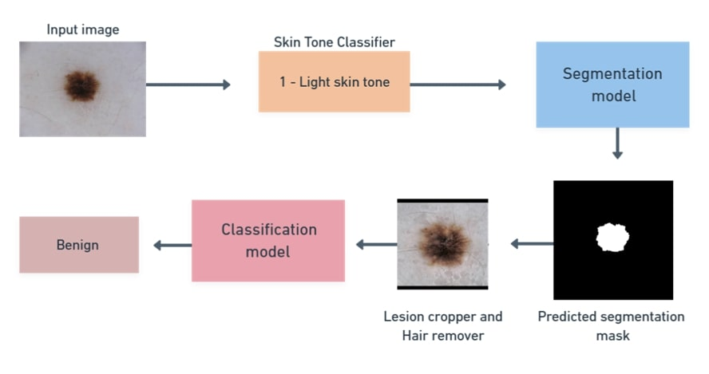

## Key Features & Techniques

*   **Fairness Focus:**
    *   Utilized ISIC (2016-2020) and Fitzpatrick17k datasets
    *   Fitzpatrick17k data (127 images of darkest skin tones) was incorporated to improve representation
    *   Targeted upsampling for underrepresented skin tones (especially the darkest category) and malignant cases
    *   GroupClassBalancedSampler used in training for equitable exposure to (skin_tone, target) groups
    *   Performance and fairness metrics (accuracy, recall, precision, F1, selection rate) monitored per skin tone using fairlearn.MetricFrame
*   **Robust Preprocessing:**
    *   Duplicate image removal
    *   Lesion cropping via the segmentation model
    *   Hair removal using inpainting
    *   Standardized 512x512 image resizing (padding for lower-res Fitzpatrick images)
    *   Preprocessing results are cached for efficiency
*   **Advanced Classification Model Training:**
    *   EfficientNet-B4 (pretrained, e.g., Noisy Student via TIMM)
    *   Focal Loss for class imbalance
    *   AdamW optimizer & OneCycleLR scheduler
    *   Progressive layer unfreezing
    *   Mixup augmentation
    *   Automatic Mixed Precision (AMP)
    *   Dynamic threshold optimization on validation data

---

## Preprocessing Components

### Skin Tone Classifier

After each image is segmented, we mask‐out the lesion and **estimate the wearer’s skin tone directly from the surrounding skin pixels**.  We compute the median brightness in CIELAB *L* space and assign the image to one of **five empirically‑derived tone bins:**

|  ID  | Tone label   |
| ---- | ------------ |
| 0    | Very light   |
| 1    | Light        |
| 2    | Medium‑light |
| 3    | Medium       |
| 4    | Dark         |

This approach avoids training an extra network (and the additional bias that could accompany it) while still giving us a strong fairness signal for sampling, model monitoring and per‑group reporting.  It is fast and deterministic, so the same image will always be assigned the same tone.  The skin tone distribution informed both our data‑balancing strategy and the fairness metrics reported in the paper.

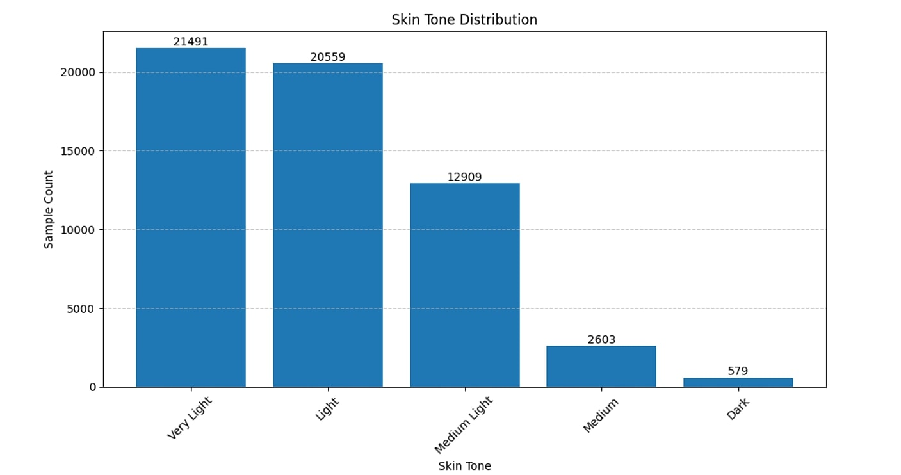

### Lesion Cropper

- **Purpose** – Standardizes lesion-focused inputs for downstream classification by automatically isolating the lesion area in dermoscopic images.
- **How it works**
    1. **Segmentation-based detection**: A pretrained model predicts a lesion mask.
    2. **Post-processing**: Morphological cleaning + small-component filtering remove artifacts.
    3. **Adaptive cropping**:
        - If the lesion is too large or no reliable mask exists → keep full image.
        - Otherwise → extract a bounding box around the mask, add a configurable margin, pad to square, and resize to the target resolution.
    4. **Image enhancement**: CLAHE and gamma correction boost contrast; dilation expands the mask slightly so surrounding context isn’t lost.
- **Benefits** – Delivers uniform, context-preserving crops that reduce background bias and guard against missed lesion edges, improving consistency and generalization across the dataset.

**Figure 1 — Successful crop**

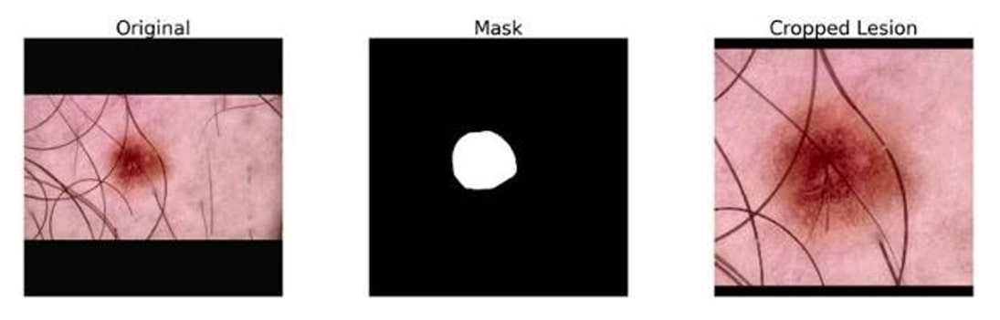

**Figure 2 — Partial crop (mask too big, falls back to full frame)**

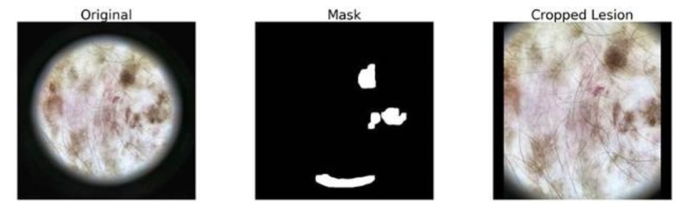

**Figure 3 — Failed crop (no valid mask detected)**

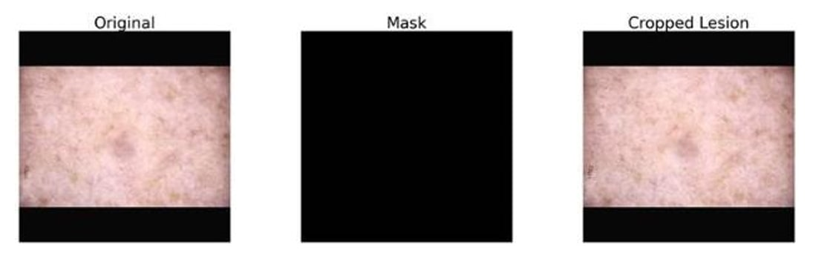


### Hair Removal

Dermoscopic photographs frequently contain dark, filament‑shaped hair artifacts that can occlude lesions and confuse the model.  We adopt a **classical black‑hat + inpainting pipeline** ([adapted from V. Parsaniya’s popular Kaggle notebook](https://www.kaggle.com/code/vatsalparsaniya/melanoma-hair-remove)):

1. Convert to grayscale and apply a morphological black‑hat filter with a 7×7 structuring element to highlight thin dark lines.
2. Threshold the response to obtain a binary hair mask; remove very small blobs to avoid erasing legitimate structure.
3. Use the mask with Telea inpainting (OpenCV) to reconstruct the underlying skin texture.

Because it is purely image‑processing based, the routine runs quickly on CPU and introduces no additional trainable parameters.  Combined with lesion cropping it yields noticeably cleaner inputs and measurably improves recall on heavily haired images.

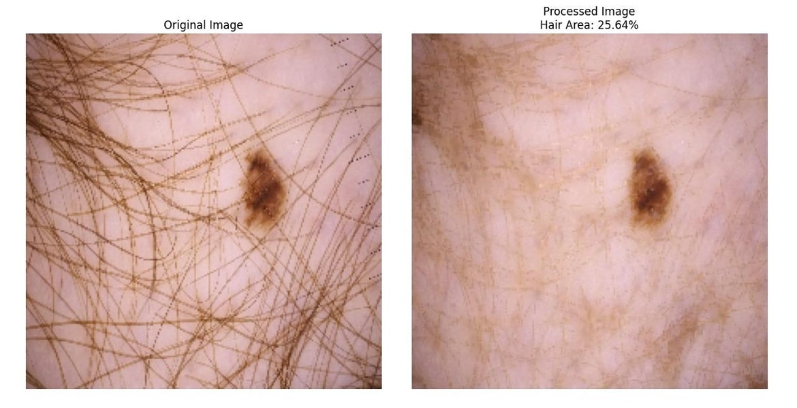

---

## Dataset Insights & Challenges

Before any balancing, we performed an exploratory analysis on the combined ISIC (2016–2020) and Fitzpatrick17k images to understand **class prevalence, skin‑tone representation and common artefacts**:

- **Class imbalance:** Malignant cases constituted only ≈22 % of the raw training pool, while some years (e.g. ISIC 2016) were as low as 19 %.
- **Skin‑tone skew:** > 70 % of the images fell into the two lightest skin tone categories (0 & 1) and < 0.5 % into the darkest category (4).  This motivated targeted up‑sampling and the inclusion of 127 Fitzpatrick17k dark‑tone images.
- **Typical artefacts:** air bubbles, glare from liquid immersion, ruler/marker overlays, vignetting, synthetic colour‑checker patches and of course dense hair.  These observations directly informed the augmentation and cleaning steps below.

**Class imbalance**

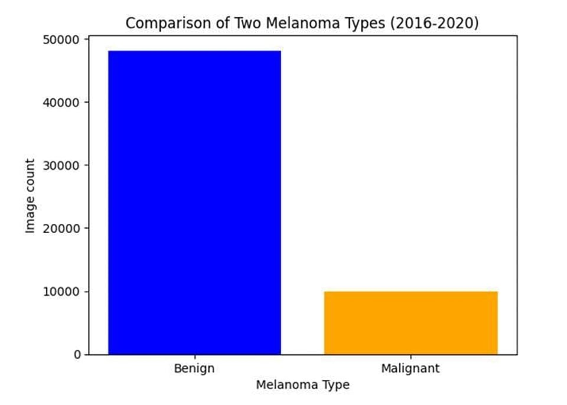

**Example 1 — Lesion obfuscated by hair, 
measurement overlay and immersion fluid**

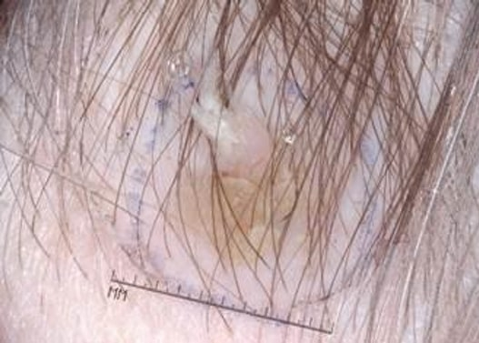

**Example 2 — Presence of clinical markings and hair**

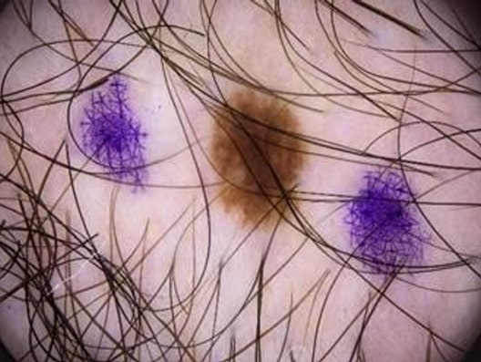

**Example 3 — Presence of immersion fluid and air 
bubbles distorting the lesion view**

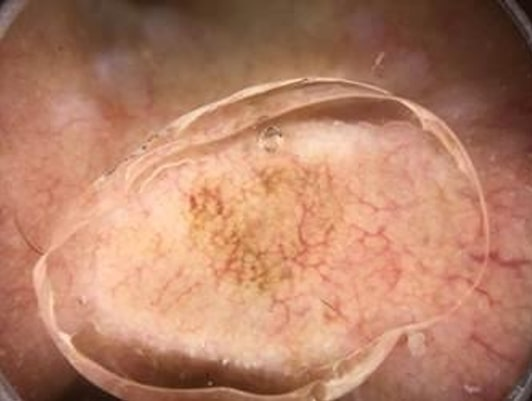

---

## Data Augmentation Strategy

### Classification (Albumentations pipeline)

| Order | Transform                                                             | Purpose                         |  p       |
| ----- | --------------------------------------------------------------------- | ------------------------------- | -------- |
| 1     | `Transpose`                                                           | simulate camera rotation        | 0.5      |
| 2–3   | `HorizontalFlip`, `VerticalFlip`                                      | left/right & up/down invariance | 0.5 each |
| 4     | `RandomBrightnessContrast` (±0.2)                                     | robustness to exposure          | 0.5      |
| 5     | `OneOf` ⟨`MotionBlur` / `MedianBlur` / `GaussianBlur` / `GaussNoise`⟩ | blur/noise robustness           | 0.7      |
| 6     | `OneOf` ⟨`OpticalDistortion` / `GridDistortion` / `ElasticTransform`⟩ | non‑rigid warps                 | 0.7      |
| 7     | `CLAHE` (clip = 4.0)                                                  | contrast boost (dermoscopes)    | 0.7      |
| 8     | `HueSaturationValue` (±10/20/10)                                      | colour drift                    | 0.5      |
| 9     | `Affine` (±5 % shift, 0.9–1.1 scale, ±15°)                            | small perspective changes       | 0.6      |
| 10    | `Resize` → 512²                                                       | uniform batch size              | —        |
| 11    | `CoarseDropout` (1–5 holes)                                           | occlusion & artefact robustness | 0.7      |
| 12    | `Normalize` / `ToTensorV2`                                            | ImageNet stats + PyTorch        | —        |

This blend of photometric, geometric and occlusion transforms proved more effective than heavier synthetic hair injection on the classification side (hair artefacts are largely removed earlier).

### Segmentation (custom OpenCV pipeline)

- **CLAHE**
- **Random flips** (horizontal 0.5, vertical 0.3)
- **RandomAffineCV** – ±15° rotation, ±5 % translation, 0.9–1.1 scale, ±5° shear
- **RandomGaussianBlur** (p = 0.1)
- **ColorJitter** (brightness/contrast ±0.15)
- **RandomSyntheticHair** – draws 5–15 thin lines to harden the mask against occlusion
- **Resize →** 512² (configurable via `SEGMENTATION_IMAGE_SIZE`)
- **ToTensor**

All transforms are paired image + mask operations to keep labels aligned.  The strong geometric jitter plus synthetic hair particularly improved boundary recall on hairy images.

---

## Segmentation Model (Lesion Localization)

**Architecture**  – We train a **U‑Net** with a **ResNet‑34 encoder** pretrained on ImageNet, enhanced with **SCSE attention blocks** and decoder‑level dropout to sharpen focus on lesion pixels and reduce over-fit.

**Loss & optimisation** – Pixel‑wise learning uses **Tversky Loss (α = 0.7, β = 0.3)** to give more weight to false‑negatives - the critical error in melanoma detection.  We employ **AdamW** with a **ReduceLROnPlateau** scheduler and **early stopping** once the validation loss flat‑lines for five epochs.

**Progressive unfreezing** – Encoder layers remain frozen for the first three epochs, after which the entire encoder is unfrozen and fine-tuning begins with a lower learning rate.

**Augmentation** – The custom OpenCV pipeline (flips, affine warp, synthetic hair, CLAHE, etc.) is applied identically to image–mask pairs, boosting boundary recall on occluded lesions.

**Checkpointing** – The lowest‑loss epoch is saved to *checkpoints/segmentation_model.pth* for use by the lesion cropper.

| Hyper‑parameter | Value     |
| --------------- | --------- |
| Input size      | 512 × 512 |
| Batch size      | 16        |
| Epochs          | 18        |
| Optimiser       | AdamW     |
| Loss            | Tversky   |

### Traning time
Approximate durations:
- Preprocessing (mask preparation and resizing): ~15 minutes
- U-Net model training: ~30 minutes

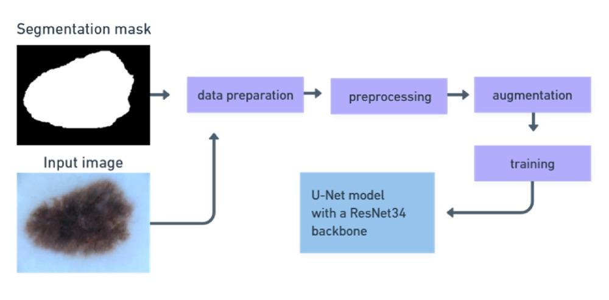

---

## Classification Model (Melanoma Prediction)

**Architecture** – We fine‑tune **EfficientNet‑B4** (Noisy‑Student weights) created through `timm` with **30 % classifier dropout** and **15 % stochastic depth (DropPath)** inside the MBConv blocks; the stock head is replaced by `Dropout → Linear(1)` for single‑logit output .

### Training recipe

| Stage | Epochs | Layers trained           | LR added / max LR                              | Notes                                              |
| ----- | ------ | ------------------------ | ---------------------------------------------- | -------------------------------------------------- |
|  #1   |  1‑4   | classifier head only     | init 1 × 10⁻⁴(OneCycle warm‑up to 1.5 × 10⁻⁴)  | build discriminative features fast                 |
|  #2   |  5‑8   | last MBConv block + head | new params @ 5 × 10⁻⁵                          | `add_new_params_to_optim` appends unfrozen weights |
|  #3   |  9‑N   | full backbone            | new params @ 5 × 10⁻⁶ ; global LR set 1 × 10⁻⁵ | gentle full fine‑tune                              |

**Optimiser** – **AdamW** (weight‑decay 1 × 10⁻³). A **OneCycleLR** schedule (max 1.5 × 10⁻⁴, 30 % warm‑up) governs the original parameters; unfrozen blocks receive progressively smaller LR tiers.

**Loss** – **Focal Loss** with **α = 3.4, γ = 2.0** emphasises hard malignant examples .  A *Class‑Balanced Focal* variant is available for skin‑tone weighting during ablation studies.

**Mixed Precision** – Training uses `torch.amp.autocast` + `GradScaler` for 2 × memory savings and \~20 % speed‑up .

**Threshold search** – After every validation epoch we call **`find_best_threshold_balanced`** to maximise F1 while equalising recall across tone groups; the chosen cut‑off (≈ 0.42‑0.48) is saved with the checkpoint for reproducible inference .

**Regularisation & Early‑stopping** – Classifier‑level dropout, stochastic depth, weight‑decay and a **10‑epoch patience** early‑stop guard against over‑fit .

| Hyper‑parameter   | Value                    |
| ----------------- | ------------------------ |
| Input size        | 512 × 512                |
| Batch size        | 32                       |
| Max LR (OneCycle) | 1.5 × 10⁻⁴               |
| Epochs (cap)      | 30 (early‑stop ≤ 20)     |
| Loss              | Focal (α = 3.4, γ = 2.0) |
| AMP               | yes                      |

### Training Time
Approximate durations:
- Preprocessing (tone estimation, cropping, hair removal): ~3 hours
- EfficientNet-B4 training (including all stages): ~8 hours

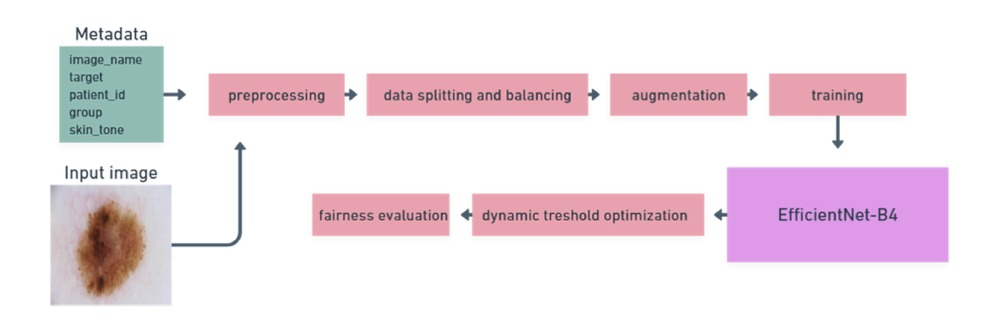

---


## Datasets & Balancing

*   **Sources:** ISIC 2016, 2017, 2019, 2020, and 127 images from Fitzpatrick17k (all categorized as darkest skin tone)
*   **Initial State:** Significant class imbalance (more benign) and underrepresentation of dark skin tones
    *   Example *Train (before balancing)*: 35,864 samples | 22.10% Malignant
*   **After Balancing (Training Set):** Through upsampling of malignant cases and dark skin tone samples, and downsampling of some benign groups:
    *   Example *Train (after balancing)*: 46,178 samples | 37.86% Malignant
    *   The proportion of darker skin tones in the training set was significantly increased
*   **Validation Set:** Maintained a distribution similar to the original data to reflect real-world scenarios
    *   Example 'Validation': 8,974 samples | 22.52% Malignant

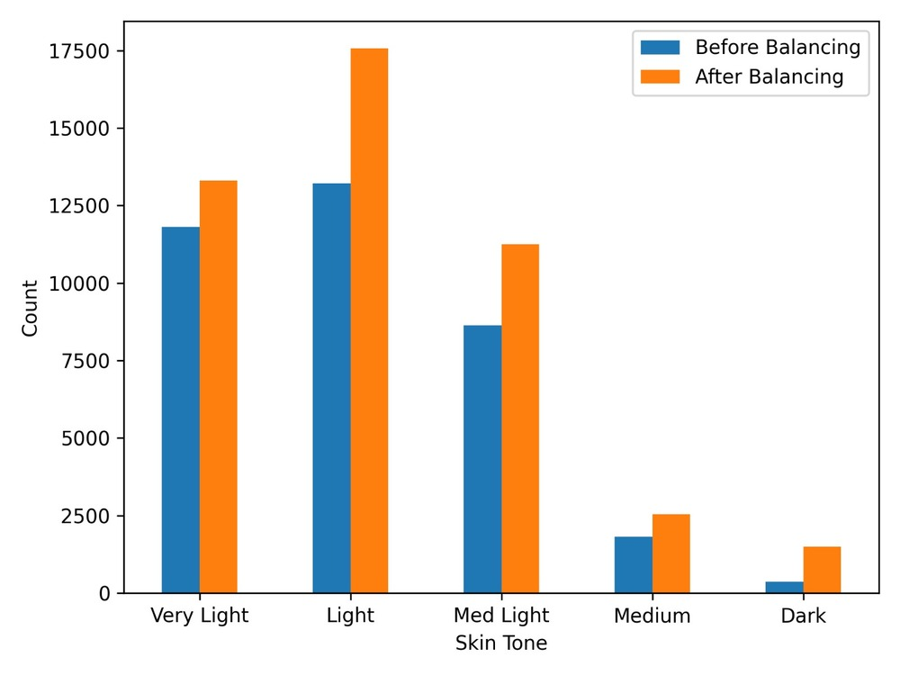

## Performance Highlights (Validation Set)

*   **Overall Accuracy: ~93.8%**
*   **Weighted F1 Score: ~0.94**
*   **Malignant Recall (Sensitivity): 89%**
*   **Malignant F1 Score: 87%**
*   **Optimal Decision Threshold: 0.4242**

**Fairness:**
The model showed relatively consistent accuracy, recall, and precision across skin tones (Max-Min disparities ~5-8%). The selection rate disparity was larger (~35%), primarily reflecting the differing true prevalence of malignancy in the validation set's skin tone groups. The darkest skin tone category (4) achieved the highest recall (94.6%) and precision (91.4%).

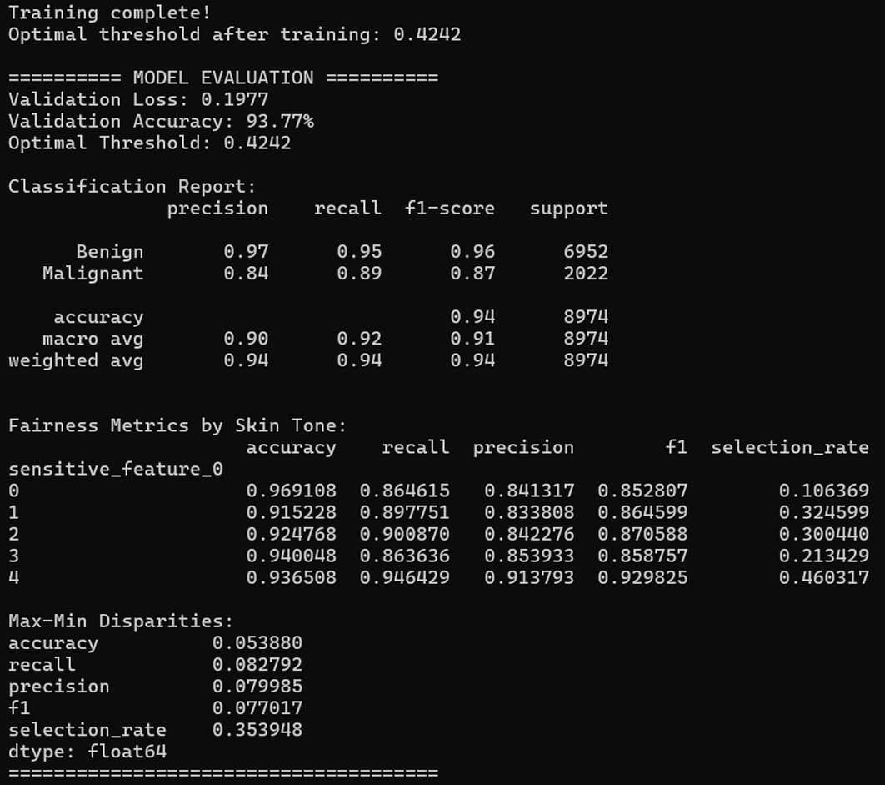


## Getting Started

### 1. Environment Setup

*   **Hardware:**
    *   CPU: AMD Ryzen Threadripper 3990X (or similar multi-core processor)
    *   GPU: 2 x NVIDIA GeForce RTX 3090 (24GB VRAM each) or similar CUDA-enabled GPU(s)
    *   RAM: 256 GB
*   **Software:**
    *   OS: Ubuntu 22.04.4 LTS / Windows 10/11
    *   NVIDIA Driver: Version 550.120 (or newer compatible version)
    *   CUDA: Version 12.4 (or newer compatible version)
    *   Python: v3.11.7
*   **Instructions:**

    *For Linux/macOS:*
    ```bash
    # Navigate to your project directory
    # Create a Python virtual environment
    python3 -m venv venv

    # Activate the environment
    source venv/bin/activate

    # Install dependencies
    pip install -r requirements.txt
    ```

    *For Windows:*
    ```bash
    # Navigate to your project directory in PowerShell or Command Prompt
    # Create a Python virtual environment
    python -m venv venv

    # Activate the environment
    .\venv\Scripts\activate

    # Install dependencies
    pip install -r requirements.txt
    ```
    
### 2. Data Preparation

To reproduce our results, you will need to download and organize the datasets as follows. All data should be placed within a data/ directory at the root of the project.

**Expected Directory Structure (inside data/):**
```
data/
├── 2016_train/                     # ISIC 2016 Images
├── 2017_train/                     # ISIC 2017 Images
├── 2019_train/                     # ISIC 2019 Images
├── 2020_train/                     # ISIC 2020 Images (JPEG format)
├── masks/                          # ISIC 2017 & 2018 Segmentation Masks
├── 2016_Metadata.csv
├── 2017_Metadata.csv
├── 2018_Metadata.csv               # Note: ISIC 2018 images are not used due to duplicates
├── 2019_Metadata.csv
├── 2020_Metadata.csv
├── Fitzpatrick_Metadata.csv
└── duplicate_images.txt
```

### Download Instructions:

1.  **ISIC Dermoscopic Images:**
    *   [*2016 Images:*](https://isic-challenge-data.s3.amazonaws.com/2016/ISBI2016_ISIC_Part3_Training_Data.zip) Extract the images into: **data/2016_train/**
    *   [*2017 Images:*](https://isic-challenge-data.s3.amazonaws.com/2017/ISIC-2017_Training_Data.zip) Extract the images into: **data/2017_train/**
    *   [*2019 Images:*](https://isic-challenge-data.s3.amazonaws.com/2019/ISIC_2019_Training_Input.zip) Extract the images into: **data/2019_train/**
    *   [*2020 Images (JPEG):*](https://isic-challenge-data.s3.amazonaws.com/2020/ISIC_2020_Training_JPEG.zip) Extract the images into: **data/2020_train/**
**Note:** ISIC 2018 images are not downloaded as they are largely duplicates found in other years and are removed during our deduplication process

2.  **Metadata Files:**
    *   [*ISIC 2016 Metadata:*](https://isic-challenge-data.s3.amazonaws.com/2016/ISBI2016_ISIC_Part3_Training_GroundTruth.csv) Download and save as **data/2016_Metadata.csv**
    *   [*ISIC 2017 Metadata:*](https://isic-challenge-data.s3.amazonaws.com/2017/ISIC-2017_Training_Part3_GroundTruth.csv) Download and save as **data/2017_Metadata.csv**
    *   [*ISIC 2018 Metadata:*](https://isic-challenge-data.s3.amazonaws.com/2018/ISIC2018_Task3_Training_GroundTruth.zip) Download, extract the CSV, and save as **data/2018_Metadata.csv**
    *   [*ISIC 2019 Metadata:*](https://isic-challenge-data.s3.amazonaws.com/2019/ISIC_2019_Training_GroundTruth.csv) Download and save as **data/2019_Metadata.csv**
    *   [*ISIC 2020 Metadata:*](https://isic-challenge-data.s3.amazonaws.com/2020/ISIC_2020_Training_GroundTruth.csv) Download and save as **data/2020_Metadata.csv**
    *   [*Fitzpatrick17k Metadata & Images:*](https://github.com/mattgroh/fitzpatrick17k/blob/main/fitzpatrick17k.csv) Save it as **data/Fitzpatrick_Metadata.csv**. The script is designed to download the images referenced in this CSV automatically during preprocessing if they are not found locally

3.  **Segmentation Masks (ISIC 2017 & 2018):**
    *   [*2017 Masks:*](https://isic-challenge-data.s3.amazonaws.com/2017/ISIC-2017_Training_Part1_GroundTruth.zip) Extract the masks into **data/masks/**
    *   [*2018 Masks:*](https://isic-challenge-data.s3.amazonaws.com/2018/ISIC2018_Task1_Training_GroundTruth.zip) Extract the masks into **data/masks/**
**Note:** There might be ~1800 images with duplicate names when extracting masks. If prompted, choose to "skip these files" as they are duplicates.

4.  **Duplicate Images List:**
    *   Download the [06 - all_train_duplicates_deleted_(all but newest).txt](https://github.com/mmu-dermatology-research/isic_duplicate_removal_strategy/blob/main/file_lists/06%20-%20all_train_duplicates_deleted_(all%20but%20newest).txt) file
    *   Save this file as **data/duplicate_images.txt**. This file is used to remove duplicate entries during the metadata cleaning process.

**Important:** After downloading, ensure your **data/** directory matches the "Expected Directory Structure" shown above. Paths and filenames are critical for the scripts to run correctly. Any deviations might require adjustments in **config/config.py**.


### 3. Training the Model
To run the full pipeline (segmentation model training + classification model training):
```bash
python train.py
```

Checkpoints are saved in **checkpoints/**. Training parameters can be adjusted in **config/config.py**.

### 4. Making Predictions
To generate predictions on a new set of images:
```bash
python predict.py <INPUT_IMAGE_FOLDER> <OUTPUT_CSV_FILE>
```

Example:
```bash
python predict.py data/my_test_images/ my_predictions.csv
```

## Project Structure
A modular structure is used:
*   **checkpoints/**: Trained model weights
*   **classification_model/** & **segmentation_model/**: Code for respective models (datasets, architectures, training logic, etc.)
*   **common/**: Shared utilities, constants, visualization
*   **config/**: Configuration files
*   **data/**: Raw and preprocessed data
*   **pipeline/**: Preprocessing steps (skin tone, lesion cropping, hair removal)
*   **utils/**: Helper functions (data sampling, thresholding)
*   root: **train.py**, **predict.py**, **requirements.txt**

# Other collaborators

Special thanks to everyone who contributed during the competition:

- [Lovro Barić](https://github.com/LoVrO312)
- [Lorena Đaković](https://github.com/lorka1)
- [Lara Slišković](https://github.com/lsliskov)
- [Zoltan Palinkaš](https://github.com/z0lt4np4l1nk4s)
